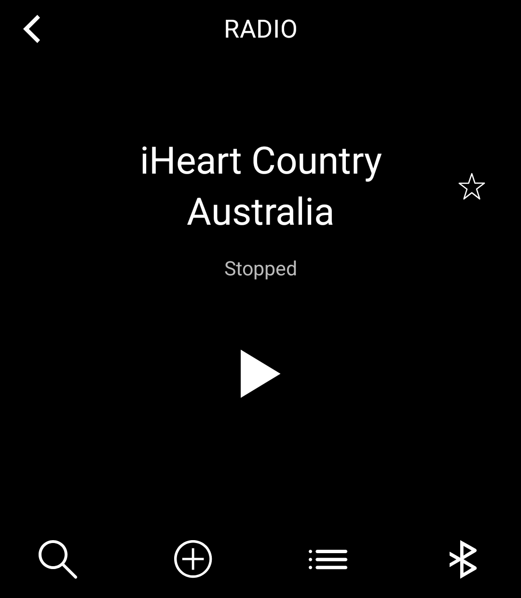
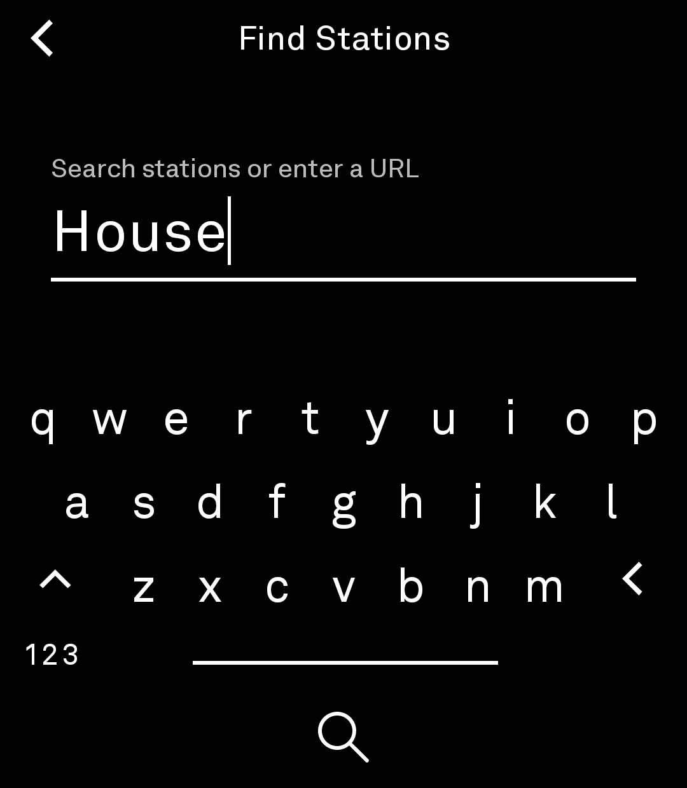
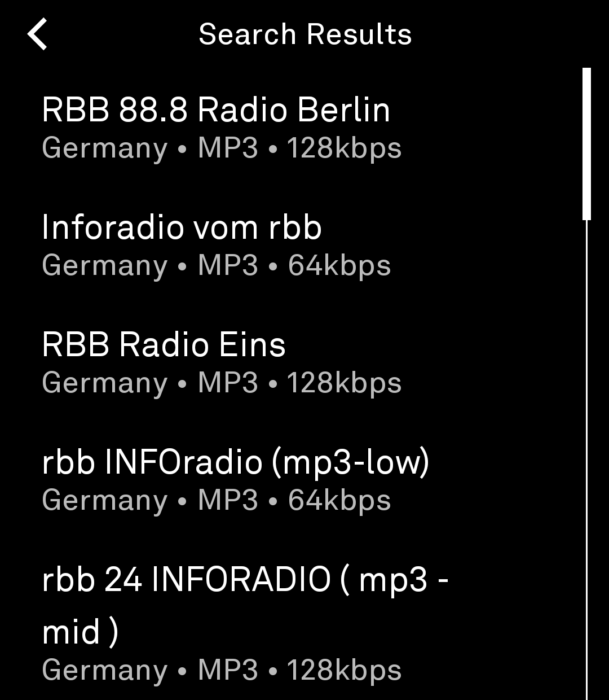
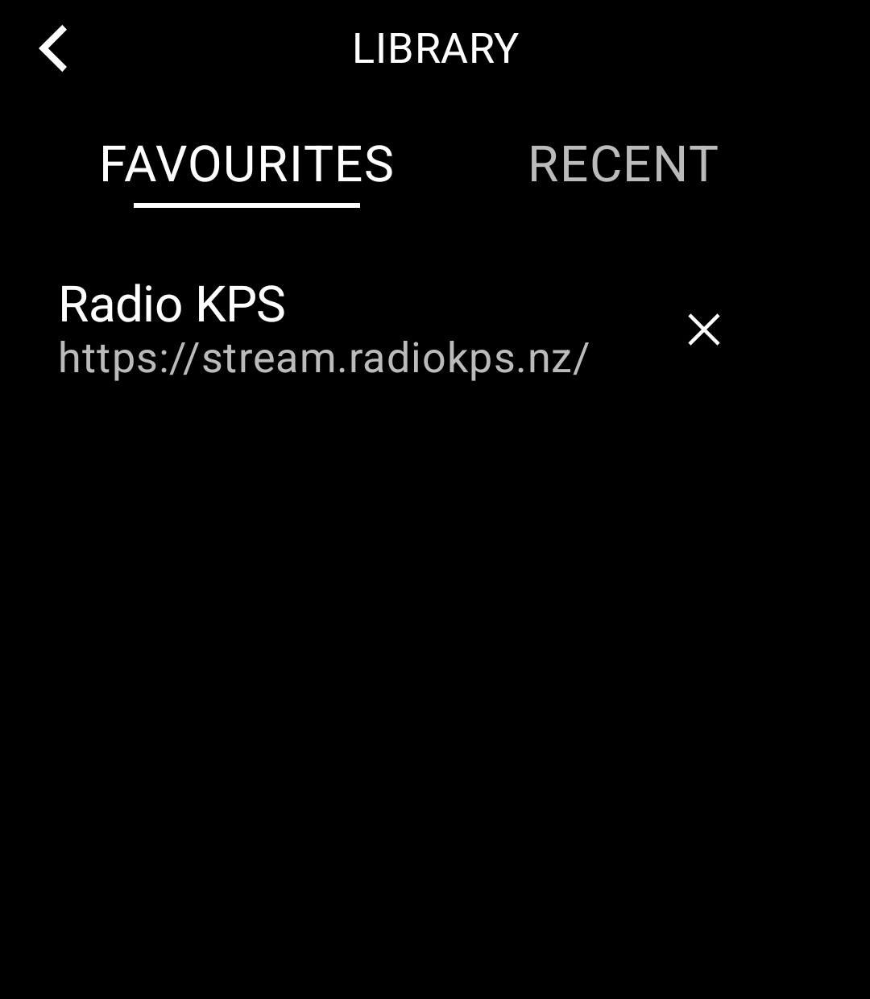

# Radio

An online radio player for the Light Phone III, built as a LightOS tool with
the [light-sdk](https://github.com/lightphone/light-sdk).

Fork of [mrrobashcroft/radio-tool](https://github.com/mrrobashcroft/radio-tool),
developed and verified on a real Light Phone III.

## What it does

- Search the [Radio Browser](https://www.radio-browser.info) directory, or
  paste any stream URL to play it directly.
- Playback keeps running with the screen off or when you open another tool.
- Favourites and recently played are saved on the phone.
- Station names that don't fit scroll like the built-in players.
- Volume is handled by the phone itself (adjusts the stream while playing).
  The bottom-right Bluetooth icon shows the connection state and opens the
  Bluetooth settings.

| | |
|---|---|
|  |  |
|  |  |

## Build

Requires a JDK 17 toolchain, Android SDK 36, and `local.properties` with
`sdk.dir`.

```bash
./gradlew :radio:assembleDebug      # debug APK
./gradlew :radio:assembleRelease    # R8-minified release APK (~6 MB)
```

## Install on the Light Phone III

```bash
adb install -r radio/build/outputs/apk/release/radio-release.apk
```

Releases are signed with the SDK dev keystore, so they sideload with
Developer → External tools set to "All tools".

## Credits

Upstream: [mrrobashcroft/radio-tool](https://github.com/mrrobashcroft/radio-tool).
Station data: [Radio Browser](https://www.radio-browser.info) community API.
MIT licensed.
